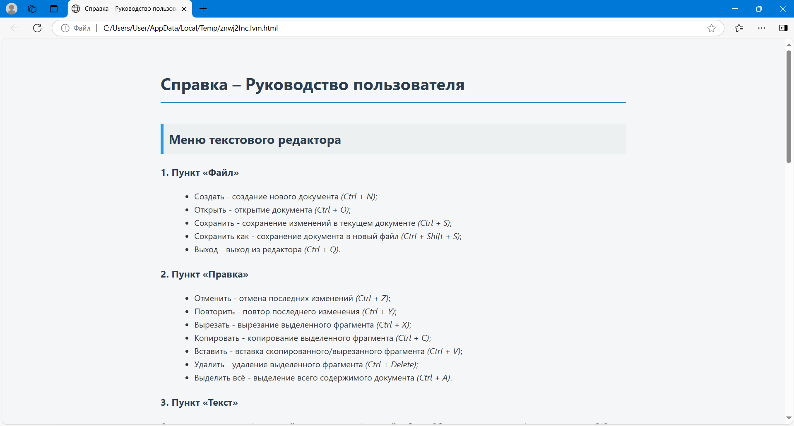
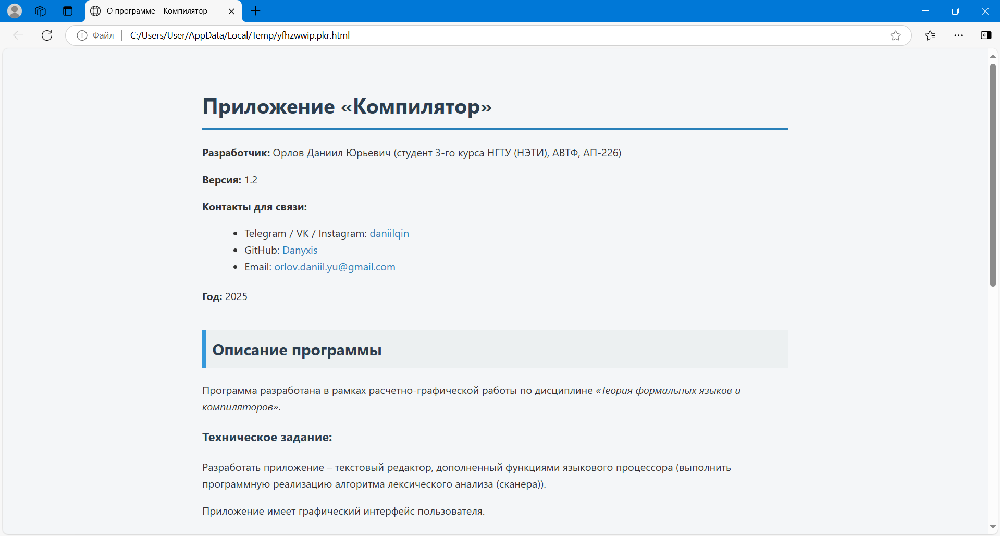

# Компилятор (CompilerApp)

Разработка текстового редактора с функциями языкового процессора.


## Содержание

- [Лабораторная работа №1: Разработка пользовательского интерфейса (GUI) для языкового процессора](#лабораторная-работа-1-разработка-пользовательского-интерфейса-gui-для-языкового-процессора)
- [Лабораторная работа №2: Разработка лексического анализатора (сканера)](#лабораторная-работа-2-разработка-лексического-анализатора-сканера)
- [Лабораторная работа №3: Разработка синтаксического анализатора (парсера)](#лабораторная-работа-3-разработка-синтаксического-анализатора-парсера)
- [Лабораторная работа №4: Нейтрализация ошибок (метод Айронса)](#лабораторная-работа-4-нейтрализация-ошибок-метод-айронса)
- [Лабораторная работа №5: Включение семантики в анализатор. Создание внутренней формы представления программы](#лабораторная-работа-5-включение-семантики-в-анализатор-создание-внутренней-формы-представления-программы)
- [Лабораторная работа №6: Реализация алгоритма поиска подстрок с помощью регулярных выражений](#лабораторная-работа-6-реализация-алгоритма-поиска-подстрок-с-помощью-регулярных-выражений)
- [Лабораторная работа №7: Реализация метода рекурсивного спуска для синтаксического анализа](#лабораторная-работа-7-реализация-метода-рекурсивного-спуска-для-синтаксического-анализа)


## Лабораторная работа №1: Разработка пользовательского интерфейса (GUI) для языкового процессора
**Тема:** Разработка текстового редактора с возможностью дальнейшего расширения функционала до языкового процессора.

**Цель работы:** Разработать приложение с графическим интерфейсом пользователя, способное редактировать текстовые данные. Это приложение будет базой для будущего расширения функционала в виде языкового процессора.

**Язык реализации:** C#, Windows Forms.

### Интерфейс текстового редактора


## Справка – Руководство пользователя приложения «Компилятор»

### Меню текстового редактора

#### 1. Пункт «Файл»

   В данном пункте меню реализован следующий функционал:

   - **Создать** - создание нового документа (*Ctrl + N*);
   - **Открыть** - открытие документа (*Ctrl + O*);
   - **Сохранить** - сохранение изменений в текущем документе (*Ctrl + S*);
   - **Сохранить как** - сохранение документа в новый файл (*Ctrl + Shift + S*);
   - **Выход** - выход из редактора (*Ctrl + Q*).


#### 2. Пункт «Правка»
   
   В данном пункте меню реализован следующий функционал:
   
   - **Отменить** - отмена последних изменений (*Ctrl + Z*);
   - **Повторить** - повтор последнего изменения (*Ctrl + Y*);
   - **Вырезать** - вырезание выделенного фрагмента (*Ctrl + X*);
   - **Копировать** - копирование выделенного фрагмента (*Ctrl + C*);
   - **Вставить** - вставка скопированного/вырезанного фрагмента (*Ctrl + V*);
   - **Удалить** - удаление выделенного фрагмента (*Ctrl + Delete*);
   - **Выделить всё** - выделение всего содержимого документа (*Ctrl + A*).


#### 3. Пункт «Текст»
   
   При вызове команд этого пункта меню - в браузере открываются HTML-документы с соответствующей 
   информацией по расчетно-графической работе «Объявление прототипа функции на языке C/C++». 
   Данный пункт меню содержит следующую информацию:

   - Постановка задачи;
   - Грамматика;
   - Классификация грамматики;
   - Метод анализа;
   - Диагностика и нейтрализация ошибок;
   - Тестовые примеры;
   - Список литературы;
   - Исходный код программы.


#### 4. Пункт «Пуск»

   - При нажатии на этот пункт происходит запуск работы языкового процесса.


#### 5. Пункт «Справка»

   При вызове команд этого пункта меню - в браузере открываются HTML-документы с соответствующей информацией.
   В данном пункте меню реализован следующий функционал:
   - **Вызов справки** - вызов справочной системы приложения (*F1*);
   - **О программе** - просмотр информации о программе.


| Раздел | Изображение |
| ------ | ------ |
| Вызов справки |  |
| О программе |  |

### Панель инструментов текстового редактора

   На данном элементе интерфейса содержатся кнопки для вызова часто используемых пунктов меню:
   - Создание нового документа;
   - Открытие документа;
   - Сохранение изменений в текущем документе;
   - Изменение размеров текста в окне редактирования и окне вывода результатов;
   - Отмена последних изменений;
   - Повтор последних действий;
   - Копирование выделенного фрагмента;
   - Вырезание выделенного фрагмента;
   - Вставка скопированного/вырезанного фрагмента;
   - Запуск работы языкового процесса;
   - Вызов справки программы;
   - Вызов информации о программе.


### Поведение интерфейса и взаимодействие с пользователем

   - Пользователь имеет возможность изменять размер окна приложения;
   - Предусмотрены минимальные ограничения размера окна приложения;
   - Пользователь имеет возможность изменять соотношение размеров области редактирования и области вывода результатов 
   с помощью разделителя между ними;
   - В окне редактирования и области вывода результатов, при необходимости, появляется полоса прокрутки;
   - При открытии нового файла или выходе из программы приложение предлагает сохранить изменения в файле, 
   если пользователь редактировал текст.


### Дополнительные возможности текстового редактора

   - Нумерация строк в окне редактирования текста;
   - В программе реализована функция Drag’n’drop – открытие документов при перетаскивании их в рабочую область программы;
   - Наличие строки состояния для отображения текущей информации о состоянии работы приложения;
   - Интерфейс с вкладками, позволяющий работать с разными модулями программы (для окна вывода результатов);
   - Отображение результатов в окне вывода в виде таблицы;
   
   **Горячие клавиши:**

   - <kbd>Ctrl</kbd> + <kbd>N</kbd> — создание нового файла  
   - <kbd>Ctrl</kbd> + <kbd>O</kbd> — открытие файла  
   - <kbd>Ctrl</kbd> + <kbd>S</kbd> — сохранение файла  
   - <kbd>Ctrl</kbd> + <kbd>Shift</kbd> + <kbd>S</kbd> — сохранение файла как  
   - <kbd>Ctrl</kbd> + <kbd>Q</kbd> — выход из приложения  
   - <kbd>Ctrl</kbd> + <kbd>Z</kbd> — отмена действия  
   - <kbd>Ctrl</kbd> + <kbd>Y</kbd> — повтор действия  
   - <kbd>Ctrl</kbd> + <kbd>X</kbd> — вырезать  
   - <kbd>Ctrl</kbd> + <kbd>C</kbd> — копировать  
   - <kbd>Ctrl</kbd> + <kbd>V</kbd> — вставить  
   - <kbd>Ctrl</kbd> + <kbd>Delete</kbd> — удалить  
   - <kbd>Ctrl</kbd> + <kbd>A</kbd> — выделить всё  
   - <kbd>F1</kbd> — вызов справки


## Лабораторная работа №2: Разработка лексического анализатора (сканера)

**Тема:** Разработка лексического анализатора (сканера).

**Цель работы:** Изучить назначение лексического анализатора. Спроектировать алгоритм и выполнить программную реализацию сканера.

| № | Тема | Пример верной строки | Справка |
| ------ | ------ | ------ | ------ |
| 22 | Объявление прототипа функции на языке C/C++ | float calculateRectangleArea(float length, float width); | [Ссылка на материал](https://www.geeksforgeeks.org/function-prototype-in-c/) |

**В соответствии с вариантом задания необходимо:**

   1. Спроектировать диаграмму состояний сканера.
   2. Разработать лексический анализатор, позволяющий выделить в тексте лексемы, иные символы считать недопустимыми (выводить ошибку).
   3. Встроить сканер в ранее разработанный интерфейс текстового редактора. Учесть, что текст для разбора может состоять из множества строк.

**Входные данные:** строка (текст программного кода).

**Выходные данные:** последовательность условных кодов, описывающих структуру разбираемого текста с указанием места положения и типа («число», «идентификатор», «знак», «недопустимый символ» и т.д.). Например, для строки:
```csharp
int x = 123;
```
<pre>
14 - ключевое слово - int - с 1 по 3 символ
11 - разделитель - (пробел) - с 4 по 4 символ
2 - идентификатор - x - с 5 по 5 символ
10 - оператор присваивания - = - с 6 по 6 символ
1 - целое без знака - 123 - с 7 по 9 символ
16 - конец оператора - ; - с 10 по 10 символ
</pre>

### Примеры допустимых строк

```c++
float calculateRectangleArea(float length, float width);
```

```c++
string inputText(char symbol);
```

```c++
bool flag();
```

```c++
int maxValue(int number1, int number2, int number3); float calculateRectangleArea(float length, float width);
```

```c++
float calculateRectangleArea(float length,float width);
```

```c++
float
calculateRectangleArea
(
float
length
,
float
width
)
;
```

### Диаграмма состояний сканера


### Тестовые примеры

> Окно вывода результатов было реализовано в виде таблицы (элемент управления DataGridView). Столбцы таблицы представляют собой индекс лексемы, её условный код, тип, значение и местоположение.

> Недопустимые фрагменты (лексемы) текста (строки) подсвечиваются в окне/области ввода/редактирования текста.

   - **Тестовый пример №1.**
   Пример, показывающий все возможные лексемы, которые могут быть найдены лексическим анализатором (сканером).

   

   - **Тестовый пример №2.** Сложный пример.

   

   - **Тестовый пример №3.** Сложный пример.

   


## Лабораторная работа №3: Разработка синтаксического анализатора (парсера)

**Тема:** Разработка синтаксического анализатора (парсера).

**Цель работы:** Изучить назначение синтаксического анализатора. Спроектировать алгоритм и выполнить программную реализацию парсера.

| № | Тема | Пример верной строки | Справка |
| ------ | ------ | ------ | ------ |
| 22 | Объявление прототипа функции на языке C/C++ | float calculateRectangleArea(float length, float width); | [Ссылка на материал](https://www.geeksforgeeks.org/function-prototype-in-c/) |

**В соответствии с вариантом задания необходимо:**
   1. Разработать автоматную грамматику.
   2. Спроектировать граф конечного автомата (перейти от автоматной грамматики к конечному автомату).
   3. Выполнить программную реализацию алгоритма работы конечного автомата.
   4. Встроить разработанную программу в интерфейс текстового редактора, созданного на первой лабораторной работе.

[Примеры допустимых строк](#примеры-допустимых-строк)

### Грамматика

G[&lt;PR&gt;]:

   - Z = &lt;PR&gt;;

   - V<sub>T</sub> = {‘int’, ‘float’, ‘char’, ‘string’, ‘bool’, ‘a’, ‘b’, ‘c’, … , ‘y’, ‘z’, ‘A’, ‘B’, ‘C’, … , ‘Y’, ‘Z’, ‘0’, ‘1’, ‘2’, … , ‘8’, ‘9’, ‘ ’, ‘(’, ‘)’, ‘,’, ‘;’};

   - V<sub>N</sub> = {&lt;PR&gt;, &lt;SPACE&gt;, &lt;IDFUNC&gt;, &lt;IDFUNCREM&gt;, &lt;EMPTY&gt;, &lt;PARAMETERS&gt;, &lt;SPACE2&gt;, &lt;IDPARAM&gt;, &lt;IDPARAMREM&gt;, &lt;END&gt;};

   - P = 
      1. &lt;PR&gt; → &lt;type&gt; &lt;SPACE&gt;
      2. &lt;SPACE&gt; → ‘ ’ &lt;IDFUNC&gt;
      3. &lt;IDFUNC&gt; → &lt;letter&gt; &lt;IDFUNCREM&gt;
      4. &lt;IDFUNCREM&gt; → &lt;letter&gt; &lt;IDFUNCREM&gt;
      5. &lt;IDFUNCREM&gt; → &lt;digit&gt; &lt;IDFUNCREM&gt;
      6. &lt;IDFUNCREM&gt; → ‘(’ &lt;EMPTY&gt;
      7. &lt;IDFUNCREM&gt; → ‘(’ &lt;PARAMETERS&gt;
      8. &lt;EMPTY&gt; → ‘)’ &lt;END&gt;
      9. &lt;PARAMETERS&gt; → &lt;type&gt; &lt;SPACE2&gt;
      10. &lt;SPACE2&gt; → ‘ ’ &lt;IDPARAM&gt;
      11. &lt;IDPARAM&gt; → &lt;letter&gt; &lt;IDPARAMREM&gt;
      12. &lt;IDPARAMREM&gt; → &lt;letter&gt; &lt;IDPARAMREM&gt;
      13. &lt;IDPARAMREM&gt; → &lt;digit&gt; &lt;IDPARAMREM&gt;
      14. &lt;IDPARAMREM&gt; → ‘,’ &lt;PARAMETERS&gt;
      15. &lt;IDPARAMREM&gt; → ‘)’ &lt;END&gt;
      16. &lt;END&gt; → ‘;’
      - &lt;type&gt; → ‘int’ | ‘float’ | ‘char’ | ‘string’ | ‘bool’
      - &lt;letter&gt; → ‘a’ | ‘b’ | ‘c’ | … | ‘y’ | ‘z’ | ‘A’ | ‘B’ | ‘C’ | … | ‘Y’ | ‘Z’
      - &lt;digit&gt; → ‘0’ | ‘1’ | ‘2’ | ‘3’ | ‘4’ | ‘5’ | ‘6’ | ‘7’ | ‘8’ | ‘9’

### Классификация грамматики

   Согласно классификации Хомского, грамматика G[&lt;PR&gt;] является автоматной (регулярной) и относится к праволинейному типу (все правила (1)-(16) относятся к классу праворекурсивных продукций), так как удовлетворяет определению: 
   G[A]: A → aB | a | ε, где a ∈ V<sub>T</sub>, A ∈ V<sub>N</sub> и B ∈ V<sub>N</sub>.

### Граф конечного автомата


Так как из состояния 4 выходят несколько переходов, помеченных одним и тем же символом из словаря, то граф конечного автомата является недетерминированным (НКА).

Преобразуем данный граф в эквивалентный детерминированный конечный автомат (ДКА). 
Преобразование НКА в ДКА представлено в таблице ниже.


Детерминированный конечный автомат представлен ниже.


### Тестовые примеры

> Недопустимые фрагменты (ошибки) текста (строки) подсвечиваются в окне/области ввода/редактирования текста.

- **Тестовый пример №1.** Все выражения введены корректно.


- **Тестовый пример №2.** Пример ошибок.


   
- **Тестовый пример №3.** Пример ошибок.


## Лабораторная работа №4: Нейтрализация ошибок (метод Айронса)

**Тема**: Нейтрализация ошибок (метод Айронса).

**Цель работы:** Реализовать алгоритм нейтрализации синтаксических ошибок и дополнить им программную реализацию парсера.

| № | Тема | Пример верной строки | Справка |
| ------ | ------ | ------ | ------ |
| 22 | Объявление прототипа функции на языке C/C++ | float calculateRectangleArea(float length, float width); | [Ссылка на материал](https://www.geeksforgeeks.org/function-prototype-in-c/) |

**В соответствии с вариантом задания необходимо:**
   - Реализовать алгоритм синтаксического анализа с нейтрализацией ошибок (метод Айронса).

[Примеры допустимых строк](#примеры-допустимых-строк)

[Разработанная грамматика](#грамматика)

[Классификация грамматики](#классификация-грамматики)

[Граф конечного автомата](#граф-конечного-автомата)

### Метод Айронса (для автоматной грамматики)

Разрабатываемый синтаксический анализатор построен на базе автоматной грамматики. Предлагается свести алгоритм нейтрализации к последовательному удалению следующего символа во входной цепочке до тех пор, пока следующий символ не окажется одним из допустимых в данный момент разбора.

Данный алгоритм нейтрализации уже был реализован в [Лабораторной работе №3: Разработка синтаксического анализатора (парсера)](#лабораторная-работа-3-разработка-синтаксического-анализатора-парсера).

В таблице «Список ошибок» выводится индекс ошибки, её описание, текст, содержащий информацию об отброшенном фрагменте, местоположение ошибки.

### Тестовые примеры

> Недопустимые фрагменты (ошибки) текста (строки) подсвечиваются в окне/области ввода/редактирования текста.

- **Тестовый пример №1.** Все выражения введены корректно.


- **Тестовый пример №2.** Пример ошибок.


   
- **Тестовый пример №3.** Пример ошибок.


## Лабораторная работа №5: Включение семантики в анализатор. Создание внутренней формы представления программы

**Тема:** Включение семантики в анализатор. Создание внутренней формы представления программы.

**Цель работы:** Дополнить анализатор, разработанный в рамках лабораторных работ, этапом формирования внутренней формы представления программы.

**Вариант задания:**
   - **1 вариант.** В качестве внутренней формы представления программы выберем польскую инверсную запись (ПОЛИЗ). Эта форма представления наглядна и достаточно проста для последующей интерпретации, которая может быть выполнена с использованием стека.

**В соответствии с вариантом задания необходимо:**

   1. Реализовать в текстовом редакторе поиск лексических и синтаксических ошибок для грамматики G[&lt;E&gt;]. 
   Реализовать данную КС-граммматику методом рекурсивного спуска:
      ```
      1. E → TA
      2. A → ε | + TA | - TA
      3. T → ОВ
      4. В → ε | *ОВ | /ОВ
      5. О → num | (E)
      6. num → digit {digit}
      ```
   2. Реализовать алгоритм записи арифметических выражений в ПОЛИЗ и алгоритм вычисления выражений в ПОЛИЗ.

### Примеры допустимых строк

```c++
100 + 25 - 5 * 10 / 2
```

```c++
((100 + 25) - 5) * (10 / 2)
```

```c++
(50 + 50 - 200) / (5 * 5) - (10 * 7)
```

### Тестовые примеры

   > Недопустимые фрагменты (ошибки) текста (строки) подсвечиваются в окне/области ввода/редактирования текста.

   - **Тестовый пример №1.** Вычисление значения арифметического выражения.

   

   - **Тестовый пример №2.** Пример ошибок.

   

   - **Тестовый пример №3.** Пример ошибок.

   

   - **Тестовый пример №4.** Пример ошибок.

   

## Лабораторная работа №6: Реализация алгоритма поиска подстрок с помощью регулярных выражений

**Тема:** Реализация алгоритма поиска подстрок с помощью регулярных выражений.

**Цель работы:** Реализовать алгоритм поиска в тексте подстрок, соответствующих заданным регулярным выражениям.

**В соответствии с вариантом задания необходимо:**

### Тестовые примеры


## Лабораторная работа №7: Реализация метода рекурсивного спуска для синтаксического анализа

**Тема:** Реализация метода рекурсивного спуска для синтаксического анализа.

**Цель работы:** Разработать для грамматики алгоритм синтаксического анализа на основе метода рекурсивного спуска.

**В соответствии с вариантом задания необходимо:**

### Тестовые примеры
